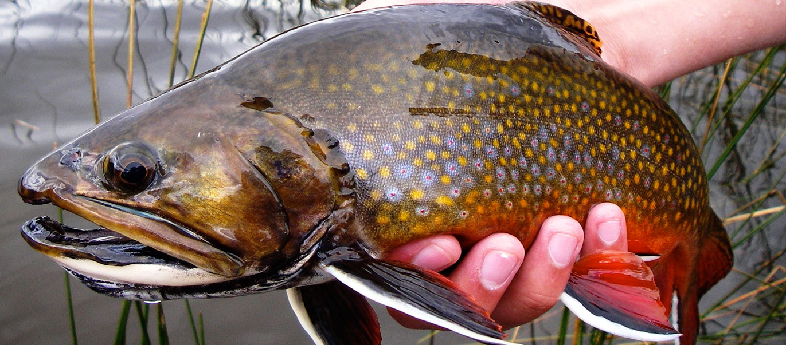
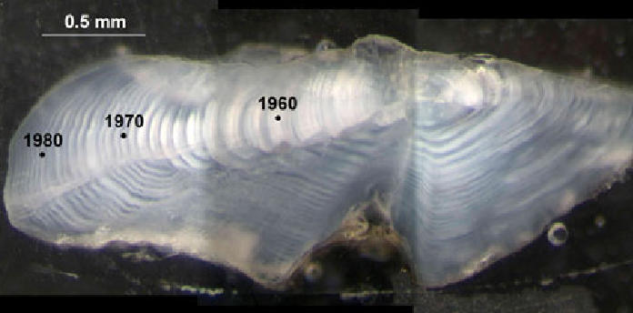
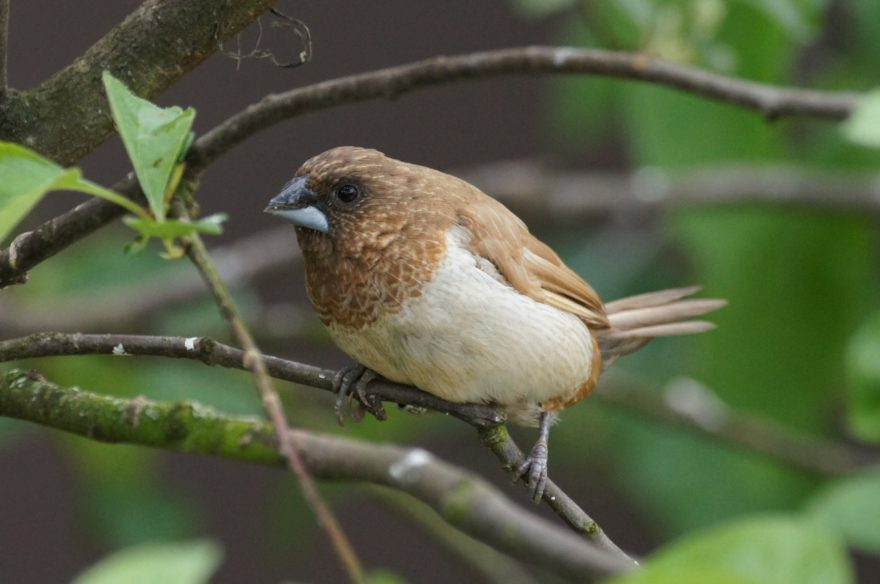

```{r setup, include=FALSE}
library(ggplot2)
library(dplyr)
library(arm)
library(MASS)
library(ggfortify)
library(nlme)
library(lme4)
library(lmerTest)
library(emmeans)
library(see)
#library(asbio)
library(pbkrtest)
library(ggtext)
library(patchwork)
library(performance)
```
<body style="background-color:lightblue;">

$~$

## Example 1: Mixed-Effects Model (Repeated Measures)

$~$

Concerned with the potential ramifications of the "browning" of high mountain lakes due to climate change, Symons et al. 2019 used otolith-derived growth data to examine the relationship between fish growth and environmental factors, such as total dissolved carbon and isotopic signatures.

I sub-sampled this dataset for 28 individuals (based on convenience) in order to examine whether growth rates differed by species (Brook or Rainbow Trout) and were affected by lake elevation. 

$~$




$~$

<span style="color:black;font-size:30px">1.1 Data visualization and summary</span>

```{r fish: read in and visualize data} 
fish <- read.csv("data/HMLgrowth.csv")

fish$individual <- as.factor(fish$individual)
fish$age <-as.factor(fish$age)

ggplot(fish, aes(age, growth.rate, colour=individual, shape=species)) +
  geom_point(size=3, position = position_dodge2(width=.33, preserve = "total")) +
  xlab ("Age (years)") +
  ylab ("Growth of Annuli Radius (cm)") + 
  labs(caption="Figure 1: Growth rates for individual trout by year in CA high mountain lakes.") + 
  theme(plot.caption=element_text(size=12, hjust=0, margin=margin(15,0,0,0)))
```

$~$

**Just to take a look at some life history information for all of the fish in this dataset:** 

```{r fish: summarise data by age}
fish_means <- fish %>%
  group_by(age) %>%
  summarise(mean_growth=mean(growth.rate),
            se_growth=sd(growth.rate)/sqrt(n()))
fish_means
```

$~$

**Raw means by species:**

```{r fish: summarise data by elevation}
fish_means_sp <- fish %>%
  group_by(species) %>%
  summarise(mean_growth=mean(growth.rate),
            se_growth=sd(growth.rate)/sqrt(n()))
fish_means_sp
```

$~$

<span style="color:black;font-size:30px">1.2 Model formation </span>

Because I was interested in whether growth rates are different between species and are influenced by the elevation of high mountain lakes, I included these as fixed effects in my model. I also included random effects in order to account for natural variation at the individual and species levels. 

```{r fish: model formation and anova table}
mixed_HML <- lmer(growth.rate~(species*elevation)+(1|species/individual), data=fish)

anova(mixed_HML)  
```

```{r fish: summary table}
summary(mixed_HML)
```

$~$

<span style="color:black;font-size:30px">1.3 Check model </span>

```{r fish: check the model assumptions, fig.height=8,fig.width=6}
#performance::check_model(mixed_HML) #Error: argument 1 is not a vector? IDK 
```

$~$

<span style="color:black;font-size:30px">1.4 Calculating marginal means </span>

Because individuals were different ages when caught and sampled, they would have contributed differently to the mean growth rates for each species (older fish would have contributed more data). 

```{r fish: fit emmeans from model - each species}
mixed_HML_emm_sp <- emmeans(mixed_HML, "species")
mixed_HML_emm_sp 
```

$~$

**Let's compare the raw and adjusted means:**

```{r fish: species emmeans as dataframe for use in plotting}
data_emm_sp <- as.data.frame(mixed_HML_emm_sp)
data_emm_sp
```

```{r raw means}
fish_means_sp
```

```{r fish: plotting elevation emmmeans}
ggplot(data_emm_sp, aes(x=species, y=emmean)) + 
  geom_point(size=4) +
  geom_errorbar(aes(ymin=emmean-SE, ymax=emmean+SE), width=.2) +
  labs(caption="Figure 2: Marginal means for each species plotted against its raw mean (1 = Brook Trout, 2 = Rainbow Trout).") +
  geom_point(data=fish_means_sp, size=4, x=fish_means_sp$species, y=fish_means_sp$mean_growth,   color="blue") +
  theme(axis.text.x = ggtext::element_markdown(color = "blue", size = 12)) +
  scale_x_discrete(name = NULL, labels = labels) +
  theme(plot.caption=element_text(size=9, hjust=0, margin=margin(15,0,0,0)))
```

$~$

**No meaningful difference between the raw and model-adjusted means** - given that we didn't uncover any significant effects, this makes sense!

$~$

## Example 2: Mixed-Effects Model (Nested Measures)

$~$

Yamada and Masayo (2016) examined changes in song characteristics of Bengalese Finches that were exposed to either a normal or high nutrition diet. 

Here, I was interested in examining the ability of the experimental treatment to explain differences in observed song duration. 

$~$



$~$

<span style="color:black;font-size:30px">2.1 Data visualization </span>

```{r bird: read in bird data and visualize, fig.height=6}
bird <- read.csv("data/nutrition_birdsong_after.csv") #19 individuals 

names(bird)

colnames(bird) <- c("ID", "song.duration", "total.notes", "tempo", "before.after", "diet")

ggplot(bird, aes(diet, song.duration, colour = ID)) + 
  geom_point(size=3, position = position_dodge2(width=.33, preserve = "total"))+ 
  xlab ("Experimental Group (Control or High Nutrition)") +
  ylab ("Song Duration (seconds)") + 
  labs(caption="Figure 3: Song duration for individual Bengalese Finches by experimental group.") + 
  theme(plot.caption=element_text(size=11, hjust=0, margin=margin(15,0,0,0)))
```

$~$

<span style="color:black;font-size:30px">2.2 Model formation and evaluation </span>

Because I was interested in the effect of diet (high nutrition or normal-control) on the song duration of the finches, I included diet as my only fixed effect and a random effect accounting for the natural variation between individuals, as well as the fact that individuals were only found in one of the treatment groups. 

```{r bird: model formulation}
bird.1 <- lmer(song.duration ~ diet + (1|diet/ID), data = bird) 

bird.1
```

```{r bird: anova table}
anova(bird.1)
```

```{r bird: summary table}
summary(bird.1)
```
$~$ 

**Non-significant effect of diet on song duration (ANOVA), but a significant effect from the control diet in the summary table.... Not sure how to interpret this?**

$~$

